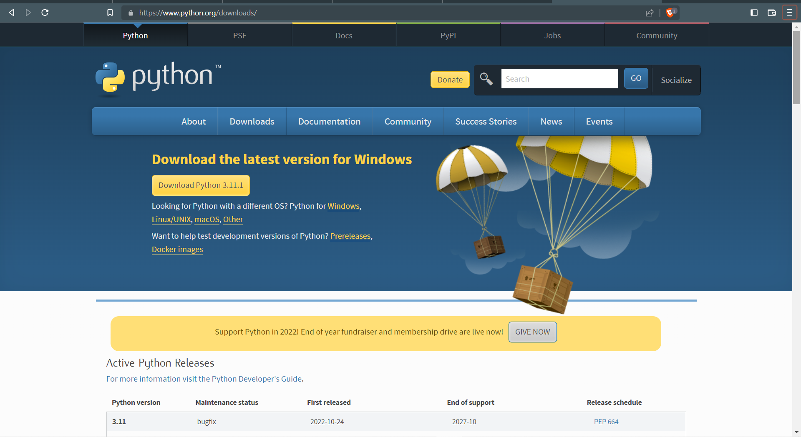
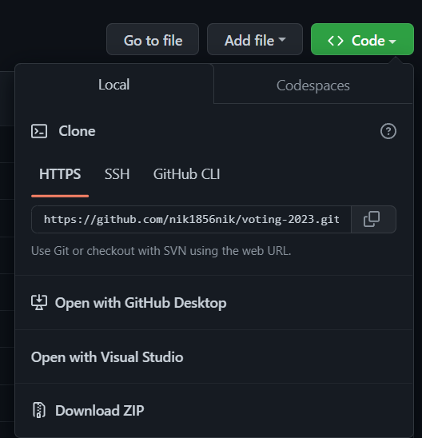
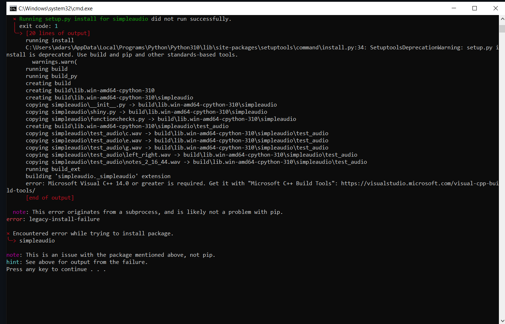
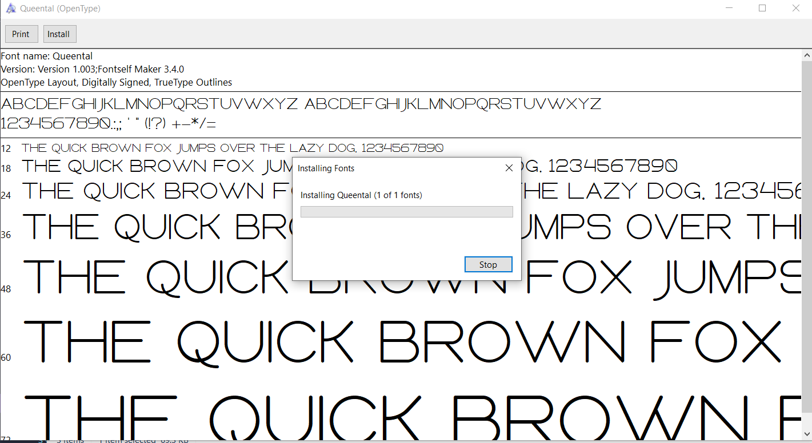
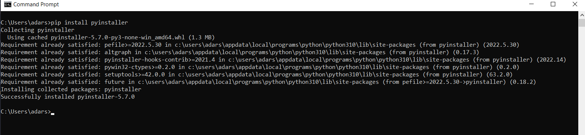
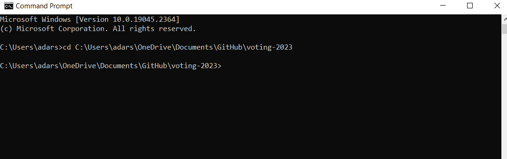
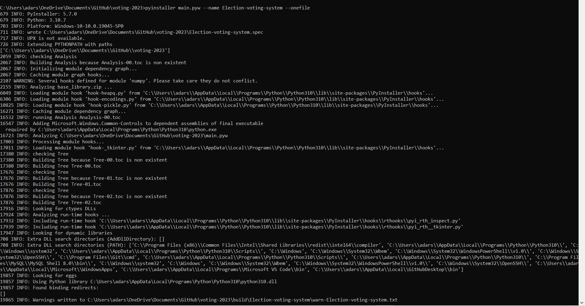
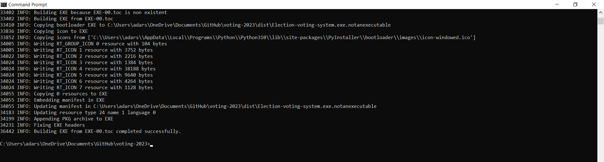
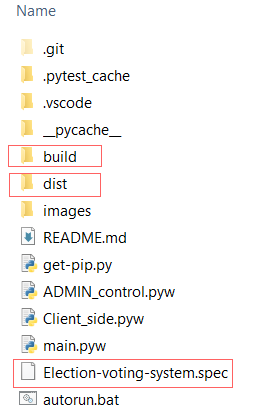

<div align="center">

  <h1> Election Voting System Using Python and tkinter</h1>
  
<sub>Author: <a>Adarsh PR, Karthik Krishna, Riya Rajesh</a><br>
<small> January, 2022</small></sub>

</div>

# Introduction
- Minimal yet powerful app for organisation Elections completely programmed using Python-3 and frontend using Python-tkinter.
- Data entry using Python and tkinter into Database managed by Mysql.

## Features

- Admin level Permissions protected by four digit passcode.
- Completely customizable.
- Save Voters list and Vote counts as csv file.
- Result in Pie and Bar graphs.

## Requirements
To get along with the challenge you need to have the following:

- Motivation
- Python-3
- MySQL
- Internet
- Python Modules mentioned below
- A code editor (preferably Vs-Code)
- Custom Font (Optional,Mentioned below)

## Setup
I believe you have the motivation, a computer and Internet. In addition to that basic to intermediate level knowledge in Python and its Modules. If you have those, then you have everything to get started.

### Install Python 3 (preferably 3.10)
Entire code runs on Python. Install [Python for windows](https://www.python.org/downloads/).

After downloading double click and install
We can check if node is installed on our local machine by opening our device terminal or command prompt.
```sh
admin $ python --version
Python 3.10.7
```

### Download git repository

Download ZIP and extract OR
### Clone git repository
Open git Bash.
Change the current working directory to the location where you want the cloned directory.
```sh
$ git clone https://github.com/nik1856nik/voting-2023
> Cloning into `Election-2023-KVK`...
> remote: Counting objects: 10, done.
> remote: Compressing objects: 100% (8/8), done.
> remove: Total 10 (delta 1), reused 10 (delta 1)
> Unpacking objects: 100% (10/10), done.
```

### Install All Required Python 3 Modules.

Modules

  - matplotlib
  - mysql-connector
  - tkinter
  - beepy

Using autorun.bat to install all required modules (Windows)

Double-Click on autorun.bat in voting-2023.

Now, Click any key to close cmd window.

OR

You can install modules using PIP
```
pip install MODULE-NAME
```

### Install Custom Fonts (Optional)

#### Fonts used
- Queental
- Consolas Bold
- Candara Light


#### Installing fonts
- Open fonts folder in the repository.
- Install one by one.


## NOTE

### Default setup
- Make sure you have mysql-connector-python installed and configured.
- The default passcode is set as 1080. To change passcode, make changes in .
- Mysql user and passwd is 'root'and 'tiger' respectively, You might need to change in  and in ![Client_side.pyw (line 9)].


## To install app as .exe file

### Install Pyinstaller module
- Open cmd and run
```
pip install pyinstaller
```



### Packaging using Pyinstaller

- Open cmd and change current working directory to voting-2023 directory
```
cd PATH\voting-2023 
```


```
pyinstaller main.pyw --name Election-voting-main --onefile
```
> --onefile is used to get output application in a single file



- After installing you can see new files in the current working directory.


- Open folder 'dist' in current working directory.
Now you can see the final application build.

## You can also run main.pyw in idle also (Without packaging using PyInstaller).

## An application With default (MySQL-user,passwd and Application Passcode) is installed in distribution folder in the repository. (Not Yet published)


